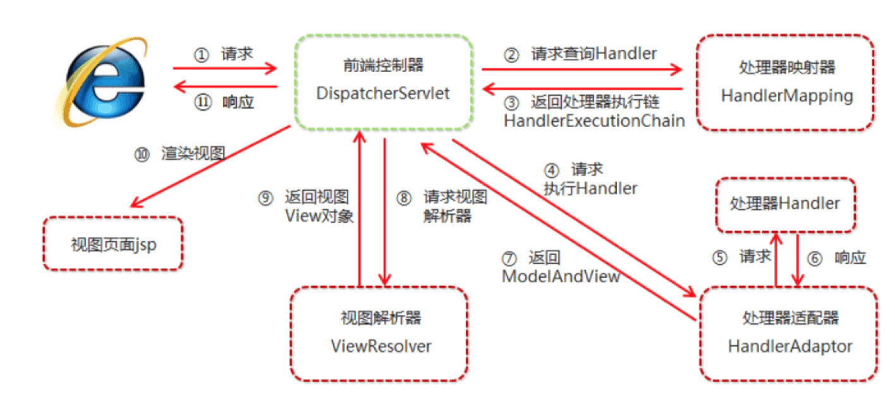

# Spring MVC

# [SpringMVC进阶](SpringMVC进阶.md)

* SpringMVC简介
* SpringMVC组件概述
* Spring请求
* Spring响应
* 静态资源开启

# 一、Spring简介
## 1.1 MVC模式
MVC是软件工程的一种架构模式，它是一种分类业务逻辑与显示界面的开发逻辑。
* M（Model）模型：处理业务逻辑，封装实体
* V（View）视图：展示内容
* C（Controller）控制器：复制调度分发（1.接收请求。2.调用模型。3.转发到视图。）

## 1.2 SpringMVC概述
        SpringMVC是基于Java实现的MVC设计模式的轻量级Web框架。它通过一套注解，让一个简单的Java类成为处理请求的控制器，
    而无须实现任何接口，支持RESTful编程风格的请求。

# 总结：    
    SpringMVC框架就是封装了原理Servlet中共用行为，例如：参数封装，视图转发等。
    
    
## 1.3 SpringMVC快速入门

## 1.4 Web工程执行流程

## 小结
    SpringMVC是对MVC设计模式的一种实现，属于轻量级WEB框架
    
    SpringMVC开发步骤：
    1.创建WEB项目，导入SpringMVC坐标
    2.配置SpringMVC前端控制器DispatcherServlet
    3.编写Controller类和视图页面
    4.使用注解配置Controller类中业务方法的映地址
    5.配置SpringMVC核心配置文件spring-mvc.xml
    

# 二、SpringMVC组件概述
## 2.1 SpringMVC执行流程

    
    1.用户打死请求至前端控制器DispatcherSevlet。
    2.DispatcherServlet收到请求调用HandlerMaping处理器映射器。
    3.处理器映射器找到具体的处理器（根据xml或注解进行查找），生成处理器对象及处理器拦截器（如果有则生成）
    一并返回给DispatcherServlet。
    4.DispatcherServlet调用HandlerAdapter处理器适配器。
    5.HandlerAdapter经过适配调用具体的处理器（Controller，后端控制器）。
    6.Controller执行完返回ModelAndView。
    7.HandlerAdapter将Controller执行结果ModelAndView返回给DispatcherServlet。
    8.DispatcherServlet将ModelAndView传给ViewResolver视图解析器。
    9.ViewResolver解析后返回具体View。
    10.DispatcherServlet根据View进行渲染视图（激昂模型数据填充至视图中）。
    11.DispatcherServlet将渲染后的视图响应用户。

## 2.2 SpringMVC组件解析
SpringMVC三大组件：处理器映射器（HandlerMapping）、处理器适配器（HandlerAdapter）、视图解析器（ViewResolver）
    
    1.前端控制器：DispatcherServlet
        用户请求到达前端控制器，它相当于MVC模式中的C，DispatcherServlet是整个流程控制的中心，由它调用其他组件处理用户请求，
    DispatcherServlet降低了组件间的耦合性。
    2.处理器映射器：HandlerMapping
        HandlerMapping负责根据用户请求找到Handler即处理器，Spring提供了不同映射器实现不同映射方式，例如：配置文件、实现接口、注解
    3.处理器适配器：HandlerAdapter
        通过HandlerAdapter对处理器进行执行，这是适配器模式的应用，通过扩展适配器可以对更多类型的处理器进行执行。
    4.处理器：Handler（开发者编写）
        开发中要编写的具体业务控制器。由DispatcherServlet把用户请求转发到Handler，由Handler对具体用户请求进行处理。
    5.视图解析器：ViewResolver
        ViewResolver负责将处理结果生成View视图，ViewResolver根据逻辑视图名解析称物理视图名（具体页面地址），再生成View视图对象，
    最后对View进行渲染，将处理结果通过页面展示给用户。
    6.视图：View（开发者编写）
        SpringMVC框架提供了很多View视图类型的支持，包括sjtlView、freemarkerview、pdfView等。最常用的视图是jsp。

## 2.3 SpringMVC注解解析


# 三、SpringMVC的请求
## 3.1 请求参数的类型
* 基本类型参数
* 对象类型参数
* 数组类型参数
* 集合类型参数

    客户端请求参数的格式是：name1=value1&name2=value2......
    服务器要获取请求参数的时候要进行类型转换或数据封装。
    
## 3.1 获取基本类型数据

## 3.4 中文乱码过滤器
```xml
    <!--    中文乱码过滤器-->
    <filter>
        <filter-name>CharacterEncodingFilter</filter-name>
        <filter-class>org.springframework.web.filter.CharacterEncodingFilter</filter-class>
        <init-param>
            <param-name>encoding</param-name>
            <param-value>UTF8</param-value>
        </init-param>
    </filter>
    <filter-mapping>
        <filter-name>CharacterEncodingFilter</filter-name>
        <url-pattern>/*</url-pattern>
    </filter-mapping>
```
 ## 3.7 [自定义类型转换器](springmvc_quickstart/src/main/java/org/example/converter/DateConverter.java)
 xml配置
 ```xml

    <context:component-scan base-package="org.example.controller"></context:component-scan>
    <!--    自定义类型转换配置-->
    <bean id="conversionService" class="org.springframework.context.support.ConversionServiceFactoryBean">
        <property name="converters">
            <set>
                <bean  class="org.example.converter.DateConverter"></bean>
            </set>
        </property>
    </bean>

```

## 3.8 [相关注解](springmvc_quickstart/src/main/java/org/example/controller/UserController.java)

| 注解 | 说明 |
| --- | --- |
| @RequestParam | 请求参数与Controller业务方法参数名不一致，通过此注解显示绑定 |
| @RequestHeader | 获取请求头数据 |
| @CookieValue | 获取cookie中的值 |

# 四、SpringMVC的响应
## 4.1 SpringMVC响应方式
    页面跳转：
        1.返回字符串逻辑视图
        2.void原始ServletAPI
        3.ModelAndView
    返回数据：
        1.直接返回字符串数据
        2.将集合或对象转为json返回


## 4.2 返回字符串逻辑视图

## 4.3 void原始ServletAPI
## 4.4 转发和重定向
## 4.5 ModelAndView

## 4.6 @SessionAttributes
在多个请求之间共享数据，可以在控制器类上标注@SessionAttributes，配置需要在session中存放的数据范围，
SpringMVC将存放model中对应的数据暂存到HttpSession中。

* @SessionAttributes只能定义在类上

## 小结
    * 页面跳转采用返回字符串逻辑视图
        1.forward转发
            可以通过Model向request域中设置值
        2.redirect重定向
            直接写资源路径，虚拟目录SpringMVC框架字自动完成拼接
    * 数据存储到request域中
        Model model
            model.setAttribute("key","value");

# 五、静态资源访问的开启
当有静态资源需要加载时，因为SpringMVC的前端控制权DispatcherServlet的url-pattern配置的是/（缺省），代表对所有静态资源都进行处理操作，
这样就不会执行Tomcat内置DefaultServlet处理。通过一下两种方式解决。

放行指定的静态资源  
方式1：
```xml
    <!--    
        mapping：放行的映射路径
        location：静态资源所在目录
    -->
    <mvc:resources mapping="/js/**" location="/js/"></mvc:resources>
    <mvc:resou-->rces mapping="/css/**" location="/css/"></mvc:resources>
    <mvc:resources mapping="/img/**" location="/img/"></mvc:resources>

```
方式2：放行全部静态资源，在SprMVC配置文件中开启DefaultServlet处理静态资源
```xml
    <mvc:default-servlet-handler></mvc:default-servlet-handler>
```