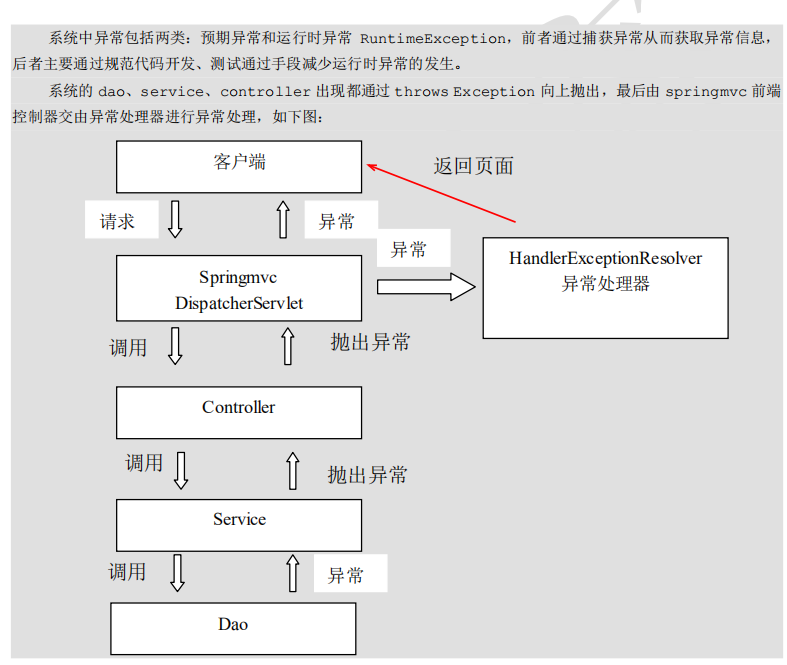

# SpringMVC进阶
* ajax异步交互
* RESTful
* 文件上传
* 异常处理
* 拦截器

# 一、ajax异步交互
SpringMVC默认使用MappingJackson2HttpMessageConverter对json数据进行转换，需要加入jackson，
同时使用\<mvc:annotation-driven/>。


## 1.1 @RequestBody\@ResponseBody
    @RequestBody
        用于Controller的方法形参声明，当使用ajax提交并指定contentType为json格式时，通过HttpMessageConverter接口转换为对应的POJO对象。
    @ResponseBody
        用于将Controller方法返回的对象，通过HttpMessageConverter接口转换为指定格式数据：json、xml等，通过Response响应给客户端。
        
        
# 二、RESTful
## 2.1 什么是RESTful？
RESTful是一种软件架构风格、设计风格而不是标准，提供了一组设计原则和约束。主要用于客户端和服务器端交互类软件，基于这种风格设计的软件可以更简洁，更有层次，
更易于实现缓存机制等。

RESTful风格的请求使用”url + 请求方式“表示一次请求目的，HTTP协议里面四个表示操作的动词：
* GET：读取 Read
* POST：新建 Create
* PUT：更新 Update
* DELETE：删除 Delete

| 客户端请求 | 原来风格的URL | RESTful风格URL |
| --- | --- | --- |
| 查询所有 | /user/findAll | GET /user |
| 根据id查询 | /user/findById?id=1 | GET /user/{1} |
| 新增 | /user/findAll | POST /user |
| 修改 | /user/findAll | PUT /user |
| 删除 | /user/findAll | DELETE /user/{1} |

## 2.2 代码实现
@PathValue
接收RESTful风格请求地址中的占位符

@ResController
RESTful多用于前后端分离项目开发，前端通过ajax与服务器进行异步交互，处理器通常返回的是json数据，
所以使用@ResController代替@Controller和@ResponseBody两个注解

# 三、文件上传
## 3.1 文件上传三要素
* 表单项type="file"
* 表单提交方式method="POST"
* 表单enctype属性是多部分表单形式enctype="multipart/form-data"

```html
<form action="${pageContext.request.contentPath}/fileUpload" method="post" enctype="multipart/form-data">
    名称：<input type="text" name="username"><br>
    文件：<input type="file" name="filePic"><br>
    <input type="submit" value="单文件上传"><br>    
</form>
```

## 3.2 文件上传原理
* 当form表单修改为多部分表单时，request.getParameter()将失效。
* 当form表单的enctype="application/x-www-form-urlencoded"时，
form表单的正文内容格式是：name1=value1&name2=value2......
* 当form表单的enctype="application/form-data时，请求内容变成多部分形式。

## 3.3 单文件上传
    1.导入commons-fileupload和common-io坐标
    2.配置文件上传解析i
    3.编写文件上传代码

请求体
```html
-----------------------------142546769122892137393712233414
Content-Disposition: form-data; name="username"

admin
-----------------------------142546769122892137393712233414
Content-Disposition: form-data; name="filePics"; filename="文件名.jpg"
Content-Type: image/jpeg
-----------------------------142546769122892137393712233414
```

# 四、异常处理
## 4.1 异常处理的思路
    1.在当前方法捕获处理（try-catch），这种处理方式造成业务代码和异常处理代码的耦合。
    2.抛给给调用者处理（throws），调用者在抛给调用者，一直向上拋。（SpringMVC的异常处理机制）




## 4.2 [自定义异常处理器](springmvc_quickstart/src/main/java/org/example/exception/GlobalExceptionResolver.java)
    1.创建异常处理器实现HandlerExceptionResolver
    2.配置异常处理器
    3.编写异常页面
    4.测试异常跳转
    
    
## 4.3 Web层异常处理机制

# 五、拦截器
## 5.1 拦截器（Interceptor）的作用
SpringMVC拦截器类似于Servlet中的过滤器Filter，用于进行*预处理*和*后处理*。
拦截器链：将拦截器按一定顺序联结成一条链。在访问被拦截方法或字段时，拦截器链中的拦截器就会按之前定义的顺序被调用。
拦截器也是AOP思想的具体实现。

## 5.2 过滤器和拦截器的区别

| 区别 | Filter | Interceptor |
| --- | --- | --- |
| 使用范围 | Servlet规范中的一部分，任何JavaWeb工程都可使用 | SpringMVC |
| 拦截范围 | url-pattern配置/*，拦截所有访问资源 | 之后拦截访问的控制器方法，访问的是jsp\html\css\image\js不会拦截 |
 
## 5.3 快速入门
[MyInterceptor1](springmvc_quickstart/src/main/java/org/example/interceptor/MyInterceptor1.java)

    1.创建拦截器实现类HandlerInterceptor接口
    2.配置拦截器
    3.测试拦截器效果

```xml
  <!--    配置拦截器-->
    <mvc:interceptors>
        <mvc:interceptor>
            <!--
                拦截路径
                对所有controller类的所有方法都拦截
             -->
            <mvc:mapping path="/**"/>
            <!--            自定义拦截器类-->
            <bean class="org.example.interceptor.MyInterceptor1"></bean>
        </mvc:interceptor>
        <mvc:interceptor>
            <mvc:mapping path="/**"/>
            <bean class="org.example.interceptor.MyInterceptor2"></bean>
        </mvc:interceptor>
    </mvc:interceptors>
```
## 5.4 拦截器链
拦截器的配置顺序就是拦截顺序。

## 5.5 拦截器方法
| 方法名 | 说明 |
| --- | --- |
| boolean preHandle(HttpServletRequest request, HttpServletResponse response, Object handler) | |
| void postHandle(HttpServletRequest request, HttpServletResponse response, Object handler, ModelAndView modelAndView) | |
| void afterCompletion(HttpServletRequest request, HttpServletResponse response, Object handler, Exception ex) | |
